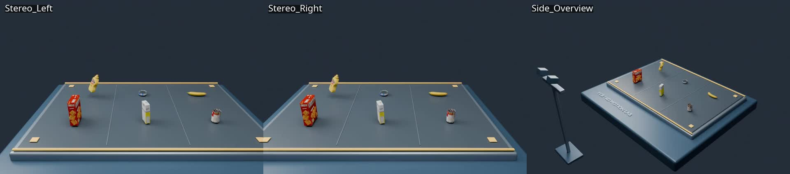

# Stereo-Camera-Calibration-System

三相机 Blender 仿真、基于 ChArUco 的多相机标定，以及物体自动标注。当前默认打开 YCB 食品物体高速运动场景，双目相机基线为 24 厘米，第三台相机从侧面观察整体环境。



## YCB 高速运动场景

场景**仅保留芥末瓶一个食品目标**，从台面后方向双目相机抛来：前进 2.3 米，沿重力抛物线上升、下落，同时自然翻滚。三路原始视频为 **3840 × 2160（4K）、60 FPS、60 帧（1 秒）**，均保存为本地 MP4，位于 `results/motion/`。并排预览缩小到 1920 × 360，查看完整 4K 请打开各相机的单独 MP4。

第三台相机从垂直于抛掷平面的正侧面观察，自动框住完整弧线和实验台，并留出至少 10% 边缘余量。可单独更新该视角：`python3 blender/launch.py record --cameras Side_Overview`。

```bash
python3 blender/launch.py open                 # 打开新的动态场景，空格播放动画
python3 blender/launch.py record               # 默认录制三路 4K 视频和每帧 6D 位姿
```

用浏览器打开 [视频播放页面](results/motion/index.html)，可同步观看三路并排视频，或切换为 0.25 倍慢放。操作、速度设置及坐标定义见 [动态场景说明](docs/MOTION.md)。原静态场景仍在 `assets/scenes/environment.blend`，原标定和标注示例继续使用它。

## 瓶子轨迹预测 V1

独立模块位于 [`trajectory_prediction/`](trajectory_prediction/README.md)，含 2026 年论文启发、后续视觉/残差学习设计和可运行基线。
默认将前 15 帧的瓶子中心生成带 1 px 噪声的双目观测，预测后 45 帧；比较匀速、自由加速度和已知重力三种方法。
这是仿真观测实验，尚未从视频检测瓶子。

```bash
.venv/bin/python -m pip install -r trajectory_prediction/requirements.txt
.venv/bin/python -m trajectory_prediction.run
xdg-open results/trajectory_prediction/index.html
```

打开 [预测与真实轨迹对比](results/trajectory_prediction/index.html)，查看轨迹图、未来误差和逐帧 CSV。

从三台相机的视频中查看投影轨迹及左上角 XYZ/误差：

```bash
.venv/bin/python -m trajectory_prediction.render_views
xdg-open results/trajectory_prediction/views/gravity/index.html
```

## 目录结构

批量实验：[`experiments/README.md`](experiments/README.md)。运行
`.venv/bin/python -m experiments.throw_suite` 可生成六物体各六组抛掷、三相机视频和预测对比。
结果保存到 `results/throw_suite/`，总表为 `summary.xlsx` / `summary.csv`。

```text
Camera/
├── calibration/              # 相机标定：普通 Python / OpenCV
│   ├── calibrate.py          # 标定板生成、内外参求解和误差报告
│   └── requirements.txt      # 标定依赖
├── blender/                  # Blender 启动与场景操作
│   ├── launch.py             # open / create / capture / create-motion / record
│   ├── create_scene.py       # 创建三相机场景（Blender Python）
│   ├── render_calibration.py # 渲染同步标定图像（Blender Python）
│   ├── download_ycb.py       # 下载带纹理的 YCB 扫描模型
│   ├── create_motion_scene.py # 创建高速运动场景
│   └── record_motion.py     # 三路同步录制和逐帧位姿导出
├── annotation/               # 物体检测框、实例掩码等标注工具
│   └── annotate.py
├── trajectory_prediction/    # 轨迹预测、双目观测仿真、评估和设计文档
├── experiments/              # 六物体×六组批量抛掷、录制、预测和表格汇总
├── assets/                   # 场景与标定板资源
│   ├── scenes/              # environment.blend 静态；ycb_motion.blend 动态
│   ├── models/ycb/          # 原始 YCB 模型，可通过下载脚本重建
│   └── boards/               # real：4 cm 格子；simulation：60 cm 格子
├── data/calibration/         # 标定输入：images/ 和独立 ground_truth.json
├── results/                  # 输出，与输入数据分开
│   ├── calibration/          # 标定参数、验证图、report.html
│   ├── annotation/          # RGB、COCO/YOLO、掩码和预览
│   ├── motion/              # 三路 MP4、并排视频、逐帧 6D 位姿和相机真值
│   └── trajectory_prediction/ # 预测对比页面、图表、指标和逐帧 CSV
├── tests/                    # 数值测试、标定真值核验、标注核验
└── docs/                     # 分功能使用说明
```

`.venv/` 是本地 Python 依赖环境，不提交 Git。`data/calibration/` 中的原始采集数据和批量角点检测预览也不提交，可通过采集命令重建。场景、标定板、代码和示例结果各自独立存放。

## 快速使用

以下命令在项目根目录执行。`launch.py` 只需要系统 Python；OpenCV 标定使用 `.venv/bin/python`；标注和场景脚本由 Blender 执行。

```bash
# 1. 打开现有 Blender 场景
python3 blender/launch.py open

# 2. 安装标定依赖（已有 .venv 时可跳过）
python3 -m venv .venv
.venv/bin/python -m pip install -r calibration/requirements.txt

# 3. 从现有标定图像估计相机参数
.venv/bin/python calibration/calibrate.py calibrate \
  --images data/calibration/images \
  --board assets/boards/simulation/board.json \
  --reference Stereo_Left \
  --zero-distortion
```

标定完成后，用浏览器打开 [results/calibration/report.html](results/calibration/report.html)。完整参数见 [calibration.json](results/calibration/calibration.json)。真实相机通常应去掉 `--zero-distortion`，并使用实测尺寸的真实标定板配置。

## 重建数据与检查

```bash
# 重新创建原静态场景（会覆盖同名场景）
python3 blender/launch.py create --baseline 0.24

# 重新渲染 30 组同步标定图像（会覆盖同名图像）
python3 blender/launch.py capture --frames 30

# 渲染目标物体图像并自动标注
blender -b assets/scenes/environment.blend --python-exit-code 1 \
  --python annotation/annotate.py

# 数值测试与标定真值检查
.venv/bin/python -m unittest discover -s tests -p 'test_*.py'
.venv/bin/python tests/verify_calibration.py

# 标注数据检查
blender -b assets/scenes/environment.blend --python-exit-code 1 \
  --python tests/verify_dataset.py
```

Blender 不在 PATH 中时：`python3 blender/launch.py --blender /path/to/blender open`。可以在子命令前加 `--dry-run` 只查看将执行的命令。启动器可从其他工作目录调用；显式传入的相对路径以调用者当前目录为准，默认路径定位到本项目。

## 详细说明

- [相机标定、真实采集要求和误差评估](docs/CALIBRATION.md)
- [Blender 场景与物体标注](docs/ANNOTATION.md)
- [目录职责与旧路径对应关系](docs/STRUCTURE.md)
- [YCB 高速运动与同步录制](docs/MOTION.md)
