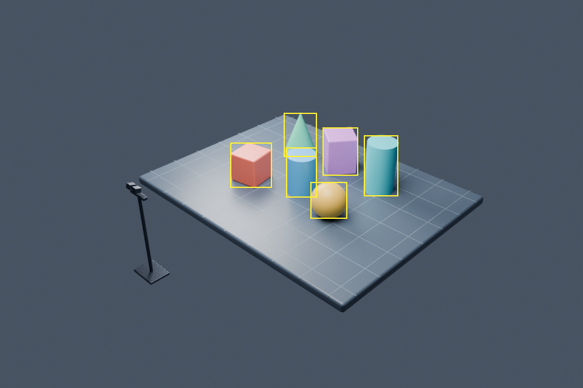

# 场景与物体标注

本页描述保留的原静态场景。当前默认打开的 YCB 动态场景与视频，请参阅 [动态场景说明](MOTION.md)。

Blender 三相机仿真与自动标注：平行双目相机、侧面全景相机，以及自动生成的检测与实例分割标注。



已生成场景：`assets/scenes/environment.blend`。用 Blender 打开即可，默认显示侧面全景相机；数字小键盘 0 进入/退出相机视图。在右侧场景属性中切换 Camera 可查看双目左右相机。

场景采用米为单位，包含 9 × 7 米网格实验台，以及 6 个目标物体（方块、圆柱、球、圆锥）。这是静态、理想针孔相机的视觉仿真场景，未加入运动、镜头畸变、传感器噪声或刚体动力学。

| 相机 | 位置（米） | 配置 |
| --- | --- | --- |
| Stereo_Left | (-0.12, -6, 2.6) | 28 mm，36 mm 传感器宽度 |
| Stereo_Right | (0.12, -6, 2.6) | 与左相机同姿态、同内参，基线 0.24 m |
| Side_Overview | (11, -12, 10) | 36 mm，侧前方俯视整个实验台和双目装置 |

双目光轴平行且略向下倾斜，没有向内汇聚；输出分辨率默认为 960 × 640。

## 运行

在本目录终端执行。脚本必须使用 Blender 自带的 Python（包含 bpy 和 NumPy），无需给系统 Python 安装依赖。

```bash
cd Stereo-Camera-Calibration-System
# 打开已生成的场景
blender assets/scenes/environment.blend

# 渲染三路图像并自动标注
blender -b assets/scenes/environment.blend --python-exit-code 1 --python annotation/annotate.py -- --output results/annotation

# 可选：重新创建场景，或修改双目基线（单位米）
blender -b --python-exit-code 1 --python blender/create_scene.py -- --output assets/scenes/environment.blend --baseline 0.24

# 可选：更高分辨率和采样数
blender -b assets/scenes/environment.blend --python-exit-code 1 --python annotation/annotate.py -- --output results/annotation_hd --width 1920 --height 1280 --samples 64

# 核验默认场景和数据集
blender -b assets/scenes/environment.blend --python-exit-code 1 --python tests/verify_dataset.py
```

重复运行会覆盖同一输出路径中的同名结果。标注脚本在后台临时调整渲染与合成节点，不会保存这些调整到原始 blend 文件。

## 输出

- `results/annotation/images/`：三台相机的 RGB PNG。
- `results/annotation/masks/`：16 位单通道 PNG，每个像素存储实例 ID，0 是背景，1–6 是目标。同一物体跨相机保持相同 ID。直接作为普通图片打开时可能近乎全黑，这是低数值 ID 的正常显示效果。
- `results/annotation/annotations_coco.json`：类别、可见边界框、可见面积和 COCO 未压缩 RLE 实例分割。
- `results/annotation/labels/`：YOLO 检测标注，每行为 `class_id center_x center_y width height`，坐标按图像尺寸归一化。
- `results/annotation/classes.txt`：YOLO 类别顺序，类别 ID 从 0 起；COCO 类别 ID 从 1 起。
- `results/annotation/previews/`：叠加黄色检测框的预览图。
- `results/annotation/calibration.json`：相机 K、无畸变系数、OpenCV 坐标系的双向外参、双目相对变换、物体位姿与尺寸。
- `results/annotation/index_exr/`：原始浮点 Object Index 通道，用于检查标注。

标注来自 Cycles Object Index 通道，考虑遮挡，仅覆盖实际可见像素。完全遮挡或离开画面的物体不输出检测框；边界框采用左上角原点的 `[x, y, width, height]`。硬实例掩码边缘不做抗锯齿。当前场景有 6 个目标，每路都能看到，共 18 条标注。

OpenCV 相机坐标为 X 向右、Y 向下、Z 向前；`world_to_camera_opencv` 满足 `P_camera = T @ P_world`。双目深度 `Z = fx * baseline / (u_left - u_right)` 表示沿光轴深度，不是到相机的欧氏距离。三路按同一帧渲染，当前脚本导出第 1 帧。

## 修改物体

可在 Blender 内移动目标并保存，再重新运行标注脚本。新增网格物体需在 Object Properties → Custom Properties 添加：

- `instance_id`：唯一整数，范围 1–32767。
- `category`：类别字符串，例如 `cube`。

平台、网格、相机外壳和支架默认作为背景。类别列表按名称排序；新增类别后请以新生成的 `classes.txt` 为准。保持相机名称不变，并使用透视、水平传感器适配、方形像素和零镜头偏移，以匹配内参导出。默认验证脚本针对本项目的 6 个目标和 24 厘米基线；修改场景后需相应调整验证预期。
